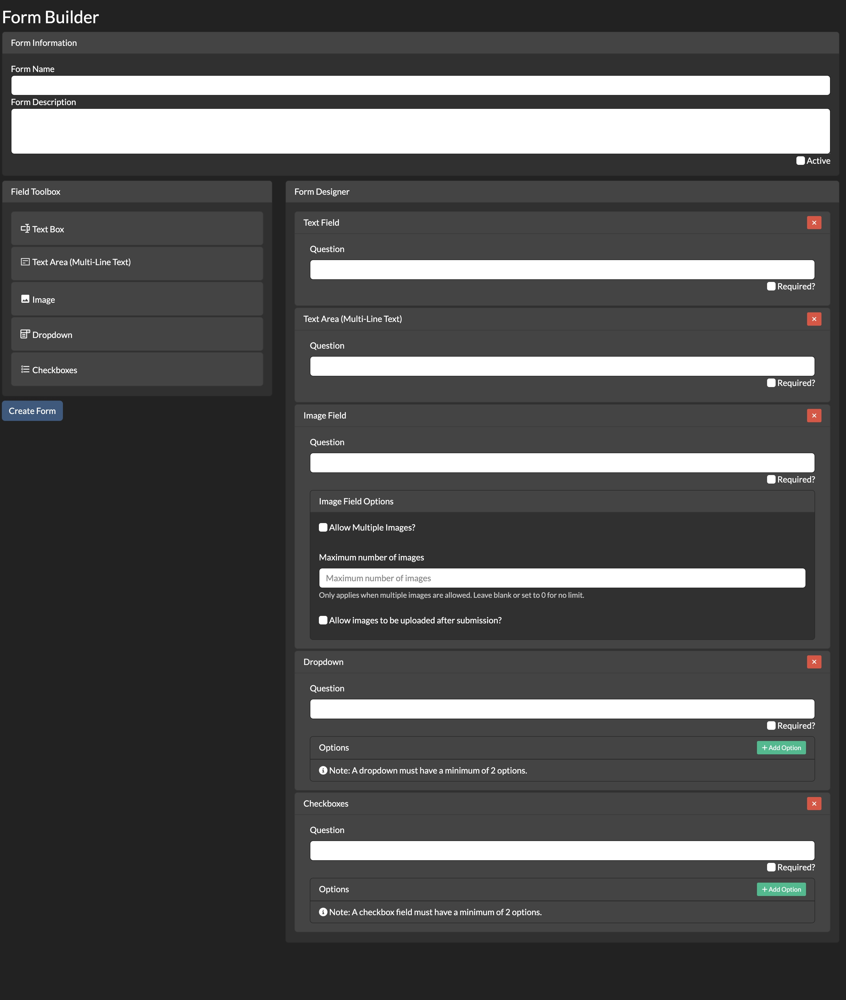
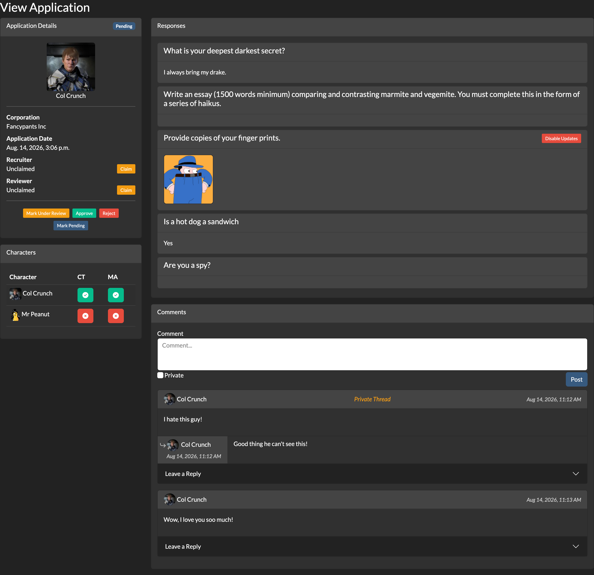
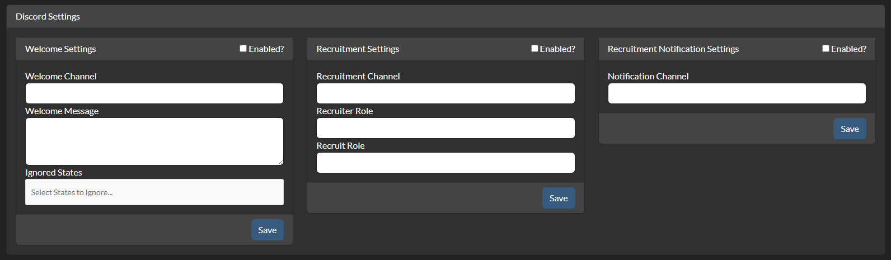
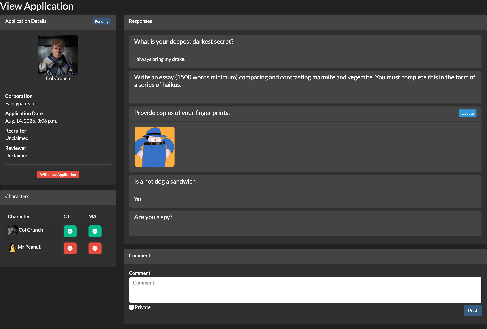
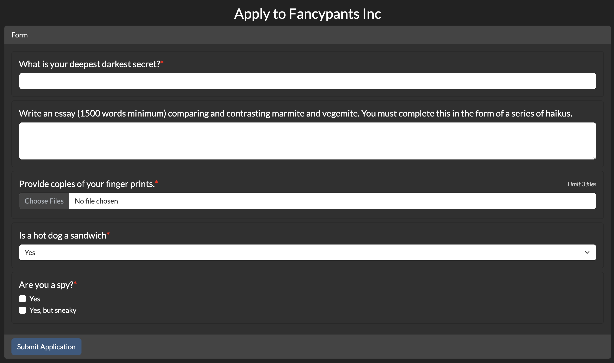

# AA-HRAPPS
A suite of HR tools for AllianceAuth.

## Features
### Form Building & Responses
* Drag-and-Drop Form Builder
* Self-Contained Form Responses

### Administration & Management
* Streamlined Admin Frontend
* Form library allows for corps to have multiple versions of their recruitment form
  * In shared auth situations, corps can copy forms from other corps.

### Communication & Collaboration
* Threaded Comments
* Private Comments

### Integrations
* Corptools & Memberaudit
* Discord Bot Integration
  * Welcome new discord users with a prompt inviting them to talk with a recruiter.
  * Facilitate discussions between Recruiters and prospective recruits with managed discord threads for recruitment.
  * Updates to HRApps cog settings do not require a restart.

### Screenshots

| Form Builder<br/>            | Admin Application View<br/> |   |
|------------------------------------------------------------------------------|---------------------------------------------------------------------------------------------------------|---|
| Discord Settings<br/> | Main Application View<br/>             |   |
| Apply View<br/>                   |                                                                                                         |   |


## Installation

### 1. Install App
Install the app into your AllianceAuth instance.
```bash
pip install aa-hrapps
```
#### Optional:
While the allianceauth-discordbot cog is included with the hrapps module, if it is not already installed, you can install it along with hrapps by using the following command instead (doing so will also ensure the right version is installed if you already have it):
```bash
pip install aa-hrapps[discordbot]
```

### 2. Cofigure AA Settings

Configure your AA settings (`local.py`) as follows:
* Modufy `INSTALLED_APPS` to include the following entries:
```py
INSTALLED_APPS = [
    # ...
    "hrapps",
    # ...
]

MEDIA_URL = "/media/"
MEDIA_ROOT = "/var/www/myauth/media/"
```

### 3. Update your webserver config

#### Nginx
If you are running nginx add the following to your site's nginx config:

```
location /media/ {
    alias /var/www/myauth/media/;
    autoindex off;
}
```

#### Apache
If you are running apache add the following to your site's config:

```
Alias /media/ /var/www/myauth/media/

<Directory /var/www/myauth/media/>
    Require all granted
</Directory>
```
### 4. Finalize Install
Run migrations and copy static files.

```bash
python manage.py migrate
python manage.py collectstatic
```

## Permissions

| Permission                         | Description                                                         |
|------------------------------------|---------------------------------------------------------------------|
| `hrappperms.access_hrapps`         | Can access the hrapps application.                                  |
| `hrappperms.access_hradmin`        | Cam access the admin frontend.                                      |
| `hrappperms.manage_hrapps`         | Full management permissions. All permission checks resolve to true. |
| `form.create_forms`                | Can create new application forms for their corp.                    |
| `form.manage_corp_forms`           | Can manage forms owned by their corp.                               |
| `forms.manage_all_forms`           | Can manage all forms regardless of corporation ownership.           |
| `formresponse.claim_recruiter`     | Can claim a response as the recruiter.                              | 
| `formresponse.claim_reviewer`      | Can claim a response as the reviewer.                               |
| `formresponse.create_response`     | Can respond to forms. (apply to corps)                              |
| `formresponse.modify_status`       | Can change the status of a response (application)                   |
| `formresponse.view_all_responses`  | Can view all responses regardless of form/corp.                     |
| `formresponse.view_corp_responses` | Can view responses to corp forms.                                   |
| `responsecomment.create_comment`   | Can comment on responses. (includes implicit view permissions)      |
| `responsecomment.view_comment`     | Can view comments on form responses                                 |